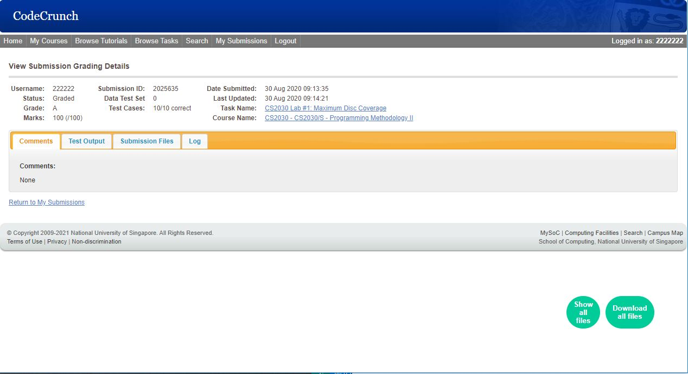
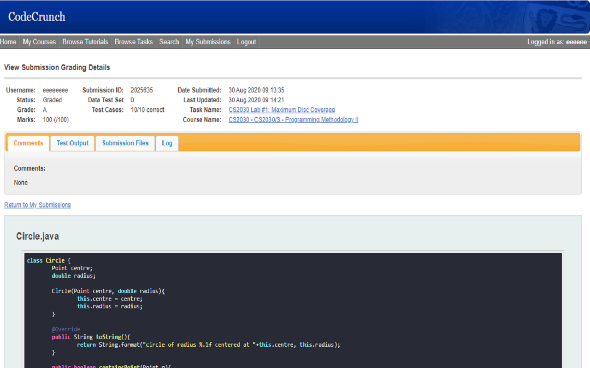
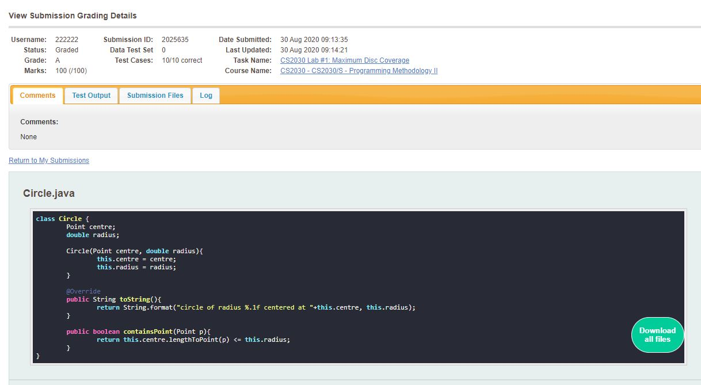
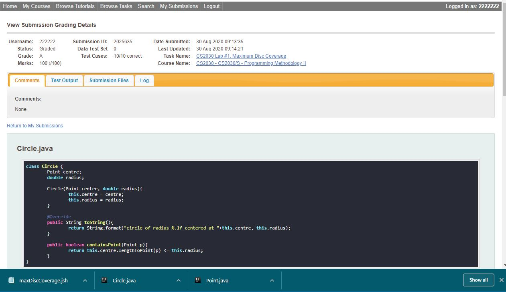

  

# CodeCrush
Available on Chrome Web Store: [Link](https://chrome.google.com/webstore/detail/codecrush/knmbadkeeocefhmonpbhokopmfjncghk)

Saving your precious seconds when using CodeCrunch.

## Description
This simple extension aims to help you while using CodeCrunch, platform for submission of coding exercises,  National University of Singapore (School of Computing).

## Features
When you are viewing your submissions on CodeCrunch, Two floating buttons will appear on the bottom right corner.
- "show all files": will display all files with syntax highlighting, on the current page.
- "download all files": will download all files in one single click.

## Screenshots

## Acknowledgement
Some code are basically scripts done by SOC seniors who had implemented the functionalities that we all wanted (Kudos to them). I modified and improved on the code to create this extension for easier use. 

## Contribution
While this is indeed a simple extension, it has truly saved some time when I was an undergraduate teaching assistant for CS2030/S. Feel free to use it and I hope it helps you too. If you like, contribute and make it better. I regret not persuing this project further and help make CodeCrunch even better, but oh well.

To contribute, simply go learn about chrome web extension development and make a PR to the github repo. I will be happy to review and merge your PR, and publish an update for this extension.